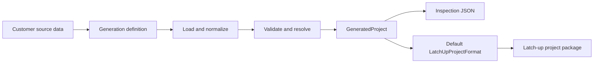

# Project Generation

Project Generation converts declarative project definitions and customer source data into validated latch-up project packages.
A neutral generated model remains available for inspection and for future custom project formats, but the latch-up implementation is the default concrete output.

The package is intended for repeatable project creation from structured customer data such as REALIS exports. Instead of writing a
custom script for every device, a generation definition describes how to:

- load and normalize project and pin data;
- create deterministic pins and groups;
- resolve device states and power assignments;
- generate test plans from reusable rules;
- expand dimensions, overrides, and stress series;
- validate the complete result before files are delivered; and
- adapt the neutral model to the customer's project format.

## Documentation

| Guide | Purpose |
| --- | --- |
| [Getting started](docs/getting-started.md) | Install the package and process a first definition. |
| [Examples](docs/examples.md) | Run complete neutral, latch-up, batch, explicit-test-plan, and REALIS generation workflows. |
| [Configuration guide](docs/configuration.md) | Understand the major sections of a generation definition. |
| [Processing model](docs/processing-model.md) | See how source data becomes a deterministic generated project. |
| [REALIS integration](docs/realis-integration.md) | Generate customer latch-up projects from REALIS JSON exports. |
| [Diagnostics and validation](docs/diagnostics.md) | Troubleshoot schema, mapping, allocation, and processing errors. |
| [Customer delivery guide](docs/customer-delivery.md) | Prepare, verify, and package a customer handoff. |
| [Development guide](docs/development.md) | Run tests, update the schema, and extend the implementation. |
| [Format specification](docs/project-generation-spec.md) | Detailed reference for the declarative format and compiler behavior. |

## How it works



A definition is processed in two layers:

1. **Core generation** produces a neutral `GeneratedProject` containing pins, groups, device states, power sequences, and test plans.
2. **Concrete project generation** writes that model using a `ProjectFormat`. `LatchUpProjectFormat` is the default implementation.

This preserves a stable extension point for another project format later without making callers select the latch-up implementation today.

## Installation

Project Generation requires Python 3.11 or newer.

```bash
python -m pip install -e .
```

For development:

```bash
python -m pip install -e ".[dev]"
pytest
```

Optional Excel source support is available through the `excel` extra:

```bash
python -m pip install -e ".[excel]"
```

## First example

Generate the default concrete latch-up project package:

```python
from project_generation import generate_project

project_path = generate_project(
    "examples/latchup_project/generation.json",
    "generated",
)
print(f"Created {project_path}")
```

The result contains a `.Prj` file, a `.LuDut` file, and one or more `.LuTstPlan` files. Use
`process_project_definition()` and `write_generated_project()` only when a neutral inspection file is useful.

## Runnable generation examples

The repository includes several complete programs that create neutral projects or packaged latch-up projects. Run these commands from the repository root, not from `docs/`; the scripts live in the top-level `examples/` directory.

```bash
python examples/neutral_project/generate_project.py
python examples/customer_project/generate_project.py
python examples/explicit_test_plan_project/generate_project.py
python examples/multiple_neutral_projects/generate_projects.py
python examples/latchup_project/generate_project.py
python examples/multiple_latchup_projects/generate_projects.py
python examples/realis/generate_single_project.py
```

Generated output defaults to `./generated`. Set `PROJECT_GENERATION_OUTPUT_DIRECTORY` to redirect all Python-example output. See the [examples guide](docs/examples.md) for the purpose and expected artifacts of each program.

## REALIS customer workflow

The repository includes a complete example that uses one shared YAML definition for multiple REALIS JSON exports:

```bash
python examples/realis/generate_projects.py
```

To process selected exports or choose another destination:

```bash
python examples/realis/generate_projects.py path/to/device-a.json path/to/device-b.json \
    --output-directory path/to/generated-projects
```

For each input, the example:

1. loads `examples/realis/generation.yaml`;
2. substitutes the current REALIS export into sources that use `{input_file}`;
3. validates and processes the definition;
4. calls the default `generate_project()` workflow; and
5. writes a latch-up package with DUT and test-plan artifacts.

See [REALIS integration](docs/realis-integration.md) for the mapping and operational details.

## Public API

### Generate the default latch-up project

```python
from project_generation import generate_project

project_path = generate_project("generation.yaml", "generated")
```

`generate_project()` uses `LatchUpProjectFormat` by default. A future format can implement `ProjectFormat` and be passed through the
`project_format` argument.

### Load and validate a definition

```python
from project_generation import load_project_definition, raise_for_diagnostics, validate_project_definition

definition = load_project_definition("generation.yaml")
raise_for_diagnostics(validate_project_definition(definition))
```

### Process a definition

```python
from project_generation import process_project_definition

generated = process_project_definition("generation.yaml")
```

### Inspect or serialize the result

```python
from project_generation import generated_project_to_json, write_generated_project

print(generated_project_to_json(generated))
write_generated_project(generated, "generated-project.json")
```

### Convert to latch-up domain objects

```python
from project_generation import adapt_to_latchup_project

artifacts = adapt_to_latchup_project(generated)
print(artifacts.dut)
print(artifacts.test_plans)
```

The latch-up imports are lazy. Core parsing and neutral generation do not require the external latch-up packages.

## Supported capabilities

The current implementation supports:

- JSON and YAML generation definitions;
- inline, JSON, CSV, and optional Excel sources;
- JSONPath-like record selection used by the supplied examples;
- nested source-to-target mappings and named value mappings;
- deterministic pin, group, device-state, and test-plan identities;
- explicit and rule-generated groups;
- explicit and generated test plans;
- group selection and `each`, `group_by`, or `all` partitioning;
- dynamic dimensions and deterministic name templates;
- ordered plan-level and group-level overrides;
- scalar, explicit, ranged, multiplied, and offset stress series;
- device-state inheritance and per-group rules;
- direct, automatic, and hybrid power allocation;
- reserved and stress-resource exclusion;
- `none` and exact same-bias ganging policies;
- deterministic power-on and power-off sequences; and
- structured processing diagnostics.

The detailed behavior and precedence rules are documented in the
[format specification](docs/project-generation-spec.md).

## Diagnostics

Processing failures raise `ProjectGenerationError`, a `ValueError` subclass with structured context:

```python
from project_generation import ProjectGenerationError, process_project_definition

try:
    process_project_definition("generation.yaml")
except ProjectGenerationError as error:
    print(error.code)
    print(error.location)
    print(error.owner)
    print(error.context)
    print(error.format_diagnostic())
```

Use the formatted diagnostic when reporting a customer data or configuration issue. It provides more actionable information than the
plain exception message alone.

## Repository layout

```text
project-generation/
├── docs/                         User, integration, delivery, and format documentation
├── examples/                     Small definitions and the end-to-end REALIS example
├── src/project_generation/       Core package and optional adapters
├── tests/                        Unit and integration tests
├── project-generation.schema.json
├── CHANGELOG.md
└── ROADMAP.md
```

## Project status

Implemented behavior is recorded in [CHANGELOG.md](CHANGELOG.md). Planned feature slices and intentionally deferred work are tracked
in [ROADMAP.md](ROADMAP.md).
