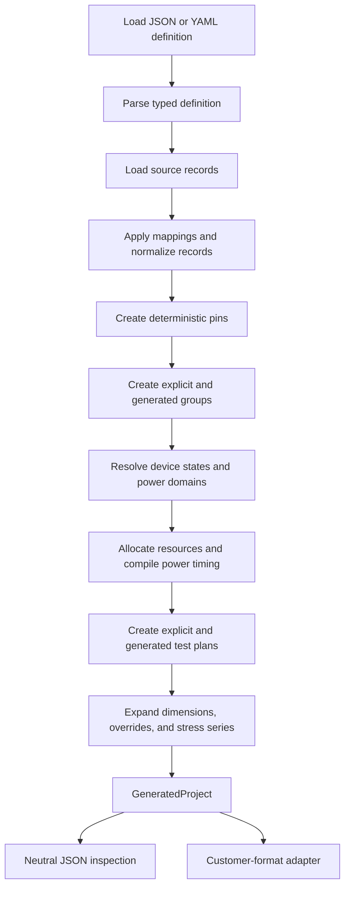

# Processing Model

Project Generation behaves like a deterministic compiler: it loads a declarative definition, resolves it against source data, validates
cross-references, and produces a concrete neutral model.

## Pipeline

## Deterministic identities

Pins, groups, device states, and test plans receive deterministic identities derived from their resolved content and ownership context.
Processing the same definition and source data should therefore produce stable references and ordering.

Stable identities are important for:

- reproducible customer deliveries;
- comparison of generated results between releases;
- linking plans to device states and groups;
- reviewing changes caused by source-data updates; and
- regression testing.

## Source normalization

Source-specific names and values should be normalized as early as possible. Record mappings move source fields into the internal shape,
and named mappings translate source vocabularies into normalized values.

For example, a customer may provide both `I` and `Input`. Mapping both to `INPUT` prevents later group and test-plan rules from containing
source-specific special cases.

## Group generation

Group processing occurs after pins are normalized. Explicit groups resolve their pin references directly. Generation rules select pins,
partition them by configured fields, derive group values, and render group names.

Member aggregation can derive a single group value from all pins in a partition. The final group retains concrete pin IDs rather than the
original source selectors.

## Device-state resolution

Device-state processing resolves:

- inheritance through `extends`;
- explicit named power domains;
- per-group rules;
- group bias objects;
- direct, automatic, or hybrid assignments;
- reserved and stress-resource exclusions;
- optional exact-bias ganging; and
- deterministic power-on and power-off sequences.

A device state in the generated model therefore contains resolved group states and assignments rather than unresolved rule expressions.

## Power sequence compilation

Named power domains may define timing dependencies. Power-on steps are topologically ordered from `after` references while preserving
declaration order where no dependency requires a different order.

When no explicit power-off timing is defined, shutdown defaults to the reverse of the resolved power-on sequence. Explicit power-off
`after` dependencies can define another valid shutdown graph.

Missing references, self-references, duplicate inherited domain names, and circular timing dependencies fail processing.

## Test-plan expansion

Test-plan generation follows this order:

1. select candidate groups;
2. partition them using `each`, `group_by`, or `all`;
3. expand configured dimensions;
4. apply dimension-specific field settings;
5. build the plan template;
6. apply ordered plan-level overrides;
7. resolve group-level values and exclusions;
8. apply ordered group-level overrides;
9. expand concrete stress points; and
10. resolve the referenced device state.

This ordering is significant. Later overrides can intentionally replace values produced by the template or earlier overrides.

## Neutral output model

The processor returns `GeneratedProject`. It contains only resolved, adapter-neutral data:

- project name and metadata;
- generated pins;
- generated groups;
- generated device states;
- power domains, group states, assignments, and sequences; and
- generated test plans, groups, dimensions, and stress points.

The neutral model is the integration boundary. Customer-specific writers should consume it through an adapter rather than adding concrete
file behavior to the core processor.

## Adapter boundary

The default `LatchUpProjectWriter` converts the neutral model into domain objects and files from the latch-up packages. The lower-level latch-up adapter remains available, and its imports are lazy, so the core
package remains usable without those dependencies.

The adapter preserves generated identities, group membership, device-state assignments, power timing, dimensions, and executable stress
plans supported by the current domain mapping.

Packaging the resulting objects into a directory or project manifest remains an integration concern. The REALIS example demonstrates one
such packaging workflow.
